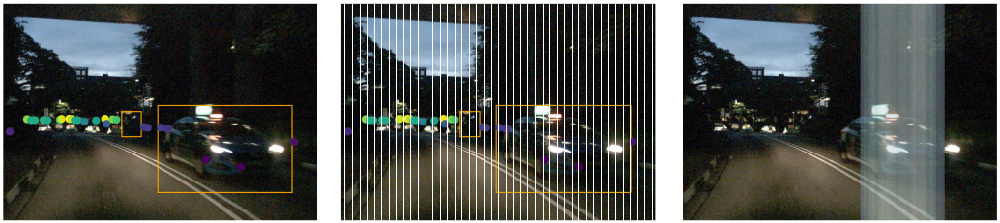

# YOdar
This is the repo for our paper "YOdar: Uncertainty-based Sensor Fusion for Vehicle Detection with Camera and Radar Sensors" (https://arxiv.org/abs/2010.03320)




The nuscenes directory is an adapted version of the nuscenes-devkit version from the year 2020 (https://github.com/nutonomy/nuscenes-devkit), where the following files are added: 
- nuscenes_buw.py
- utils/get_rectangle_buw.py

and the following files are changed:
- utils/data_classes.py

<!-- There are two config-files, one in the YOdar root folder. The other one in the YOLO folder -->


## Installation
It is recommended to create a python3 environment and install all required packages. Our code runs with python version 3.6.15
```bash
pip install --upgrade pip
pip install -r requirements.txt
```

**1. Stage: Data preparation:** <br>
1. Download the nuScenes dataset from: https://www.nuscenes.org/nuscenes 
2. Insert the path of the dataset and adjust the parameters in ```config.py```
3. start the data preparation process:
```bash
python preprep.py
```
** Infos** \
The pkl-file is a list of dictionaries. each dictionary has the following keys:
- scene
- pic
- file_path
- radar_data    (list of all 4 features with 160 entries)
- bbox          (coordinates of all 4 corners of each bounding box)
- gt            (ground truth vector (160 entries))

**2. Stage: Train the radar network** <br>
Adjust the parameters for training in ```config.py``` and start it with:
```bash
python training_radar.py
```


## Citation
If you find our work useful for your research, please cite our paper:
```
@conference{icaart21,
author={Kamil Kowol. and Matthias Rottmann. and Stefan Bracke. and Hanno Gottschalk.},
title={YOdar: Uncertainty-based Sensor Fusion for Vehicle Detection with Camera and Radar Sensors},
booktitle={Proceedings of the 13th International Conference on Agents and Artificial Intelligence - Volume 2: ICAART},
year={2021},
pages={177-186},
publisher={SciTePress},
organization={INSTICC},
doi={10.5220/0010239301770186},
isbn={978-989-758-484-8},
issn={2184-433X},
}
```
